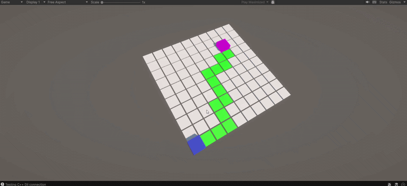

# C++ Unity Pathfinding Demo

A custom C++ pathfinding library integrated into Unity via P/Invoke. Features dynamic obstacle toggling and live path recalculation using A* and Dijkstra algorithms.



## Running the Project

1. Run the build script to compile the C++ backend:
   ```bash
   ./build.sh
